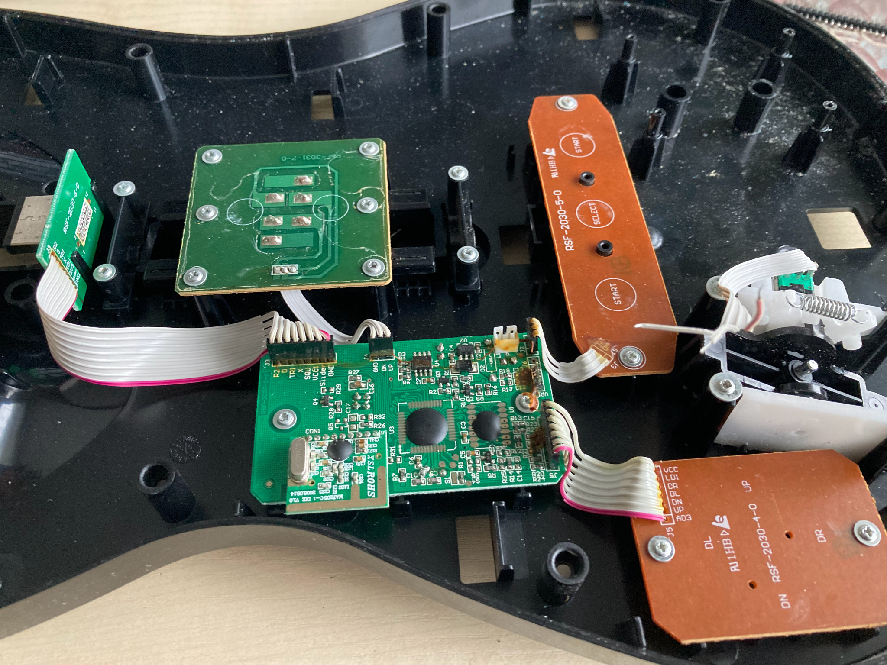
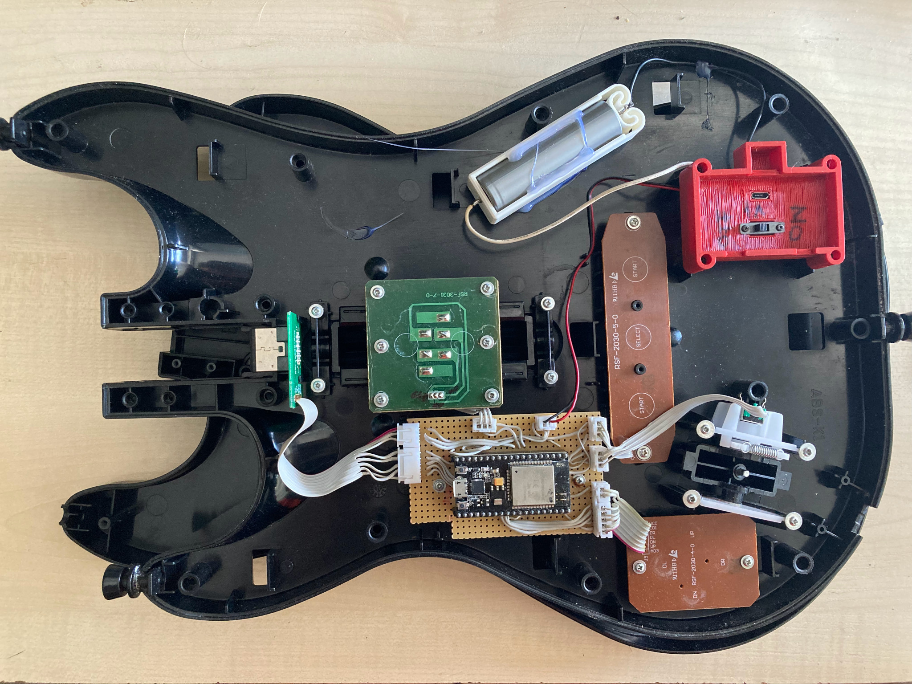

# feature-idf
> [!NOTE]
> WIP: migrating PlatformIO to ESP-IDF based project

### TODO:
- [ ] Add Guitar hero HID descriptor (except not if breaking XInput BLE implementation)
- [ ] map buttons on controller to work by plug-and-play so Guitar Hero 3 (PC) will recognise it

## ESP32 BLE guitar

Transform toy guitar into a Clone Hero controller with ESP32

**Pinout**

| ESP32 GPIO | Button               |
| ---------- | -------------------- |
| GPIO36     | Whammy potentiometer |
| GPIO32     | Strum up             |
| GPIO33     | Strum down           |
| GPIO26     | R2 (Green button)    |
| GPIO27     | O (Red button)       |
| GPIO14     | TRI (Yellow button)  |
| GPIO15     | X (Blue button)      |
| GPIO13     | SQU (Orange button)  |
| GPIO23     | LED on DPAD          |
| GPIO22     | Start                |
| GPIO21     | Select               |
| GPIO19     | DPAD RIGHT           |
| GPIO18     | DPAD LEFT            |
| GPIO17     | DPAD DOWN            |
| GPIO16     | DPAD UP              |

**Before:**

**After:**

